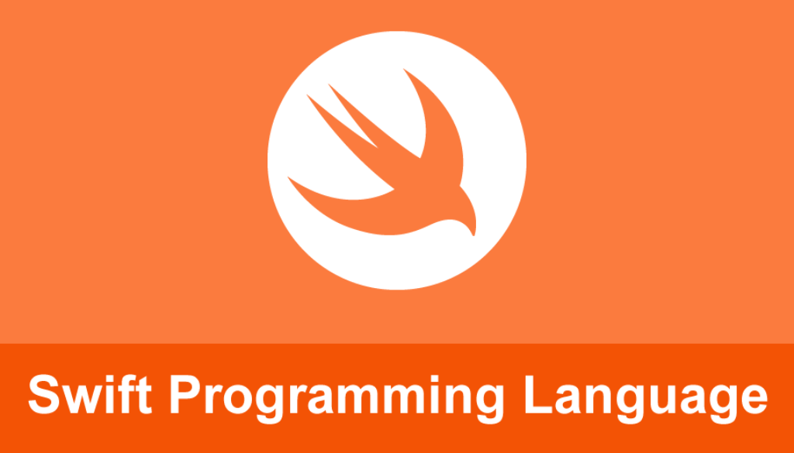

# Swift 101 Eğitimi (Swift 101 Tutorial)

## Projenin Amacı

Swift-4 ile ilgili en temel konulardan başlayıp ileri seviye konuları hem kendim öğrenmek hem de öğrendiğim bilgileri sizlerle paylaşarak etkileşimli bir proje oluşturmak. Arkadaşlar her türlü eleştiri ve desteğe açığım :smile:

## Projenin İçeriği
Swift-4 ile programlamanın temelleri hakkında çeşitli bilgi ve örnekler içeren bir projedir.  

## Projenin Konuları

- [Hello World](https://github.com/halilozel1903/Swift101/tree/master/HelloWorld.playground)
- [Variables(Değişkenler)](https://github.com/halilozel1903/Swift101/tree/master/Variables.playground)
- [String Methods-1](https://github.com/halilozel1903/Swift101/tree/master/String.playground)
- [String Methods-2](https://github.com/halilozel1903/Swift101/tree/master/StringExample.playground)
- [Int, Float ve Double](https://github.com/halilozel1903/Swift101/tree/master/Int%26Double%26Float.playground)
- [Boolean](https://github.com/halilozel1903/Swift101/tree/master/Boolean.playground)
- [Arrays(Diziler)](https://github.com/halilozel1903/Swift101/tree/master/Arrays.playground)
- [Dictionaries(Sözlükler)](https://github.com/halilozel1903/Swift101/tree/master/Dictionaries.playground)
- [While Loop(While Döngüsü)](https://github.com/halilozel1903/Swift101/tree/master/WhileLoop.playground)
- [For Loop(For Döngüsü)](https://github.com/halilozel1903/Swift101/tree/master/ForLoop.playground)
- [If,Else](https://github.com/halilozel1903/Swift101/tree/master/IfElse.playground)
- [Switch-Case](https://github.com/halilozel1903/Swift101/tree/master/SwitchCase.playground)
- [Functions(Fonksiyonlar)](https://github.com/halilozel1903/Swift101/tree/master/Function.playground)
- [Class(Sınıflar)](https://github.com/halilozel1903/Swift101/tree/master/Classes.playground)
- [Optionals(Opsiyoneller)](https://github.com/halilozel1903/Swift101/tree/master/Optionals.playground)
- [Sets](https://github.com/halilozel1903/Swift101/tree/master/Sets.playground)
- [Enumerations](https://github.com/halilozel1903/Swift101/tree/master/Enumerations.playground)
- [Methods(Metodlar)](https://github.com/halilozel1903/Swift101/tree/master/Methods.playground)
- [Structures(Yapılar)](https://github.com/halilozel1903/Swift101/tree/master/Structures.playground)
- [Type Casting](https://github.com/halilozel1903/Swift101/tree/master/TypeCasting.playground)
- [Convert Data Types](https://github.com/halilozel1903/Swift101/tree/master/ConvertDataTypes.playground)

 

## Swift 101 - Örnek Uygulamalar

- [Calculator](https://github.com/halilozel1903/Swift101/tree/master/Calculator.playground)
- [Find My Age](https://github.com/halilozel1903/Swift101/tree/master/FindMyAge.playground)
- [Prime Number](https://github.com/halilozel1903/Swift101/tree/master/PrimeNumber.playground)
- [How Many Fingers](https://github.com/halilozel1903/Swift101/tree/master/HowManyFingers)
- [Find Cats Age](https://github.com/halilozel1903/Swift101/tree/master/CatYearsFind)
- [Classes & Objects](https://github.com/halilozel1903/Swift101/tree/master/Classes%26Objects.playground)

## Yararlandığım Kaynaklar

1. https://docs.swift.org/swift-book/GuidedTour/GuidedTour.html
2. https://www.udemy.com/ios-11-swift-4-baslangictan-ileri-seviyeye-mobil-uygulama
3. https://www.tutorialspoint.com/swift/index.htm
4. https://www.mobilhanem.com/swift-egitimi/
5. https://www.udemy.com/draft/1317952/learn/v4/
6. https://www.udemy.com/complete-ios-11-developer-course/

# NOT
Ders,kaynak ve proje eklemeleri devam edecektir.  

 
